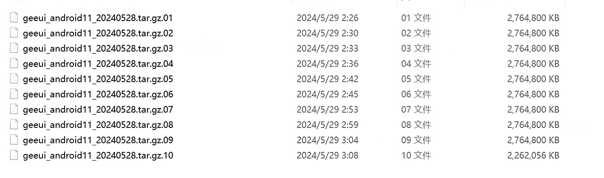

## Download GeeUI ROM method:

Download address:

Download the system as shown in the figure:

## Decompression:

Extract the ROM into the Linux system, then execute the following command to merge the compressed files and decompress them
```
cat geeui_android11_20240528.tar.gz.* | gzip -c > geeui_android11_20240528.tar.gz
tar -zxvf geeui_android11_20240528.tar.gz
```

## Compilation:
After decompression, enter the system directory for compilation and execute the following command to compile:

```
. build/envsetup.sh
lunch  2
./build.sh -AKUup
```
Compilation completed, the compiled system image update.img can be found in out
## Burn
Please refer to the following article for the burning method. Change the burning package to the image compiled above.
[Burning method](https://global.letianpai.com/all/?p=1680&v=8528837ceeea)
